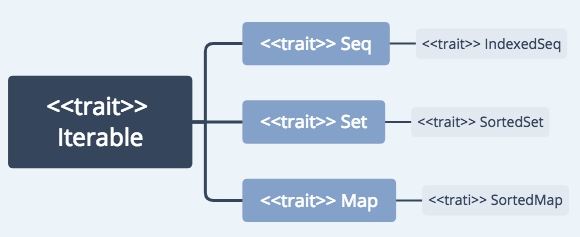

*	All collections extend the `Iterable` trait
* 	`sequences`, `sets`, `maps`
*  `muteable` or `immutable`
*  A Scala list is either empty, or it has a head and a tail which is again a list.
*  Sets are unordered collections.
*  Use a `LinkedHashSet` to retain the insertion order or a `SortedSet` to iterate in sorted order.
*  `+` adds anelementtoanunorderedcollection
*  `+:` prepend to a sequence
*  `:+` append to a sequence
*  The `Iterable` and `Seq` traits have dozens of useful methods for common operations.
*  Mapping, folding, and zipping are useful techniques for applying a function or operation to the elements of a collection.


### 1. Iterable
```
val coll = 
val iter = coll.iterator
while(iter.hashNext) {
	
}
```

```
toSeq
toSet
toMap
to[ArrayBuffer]
```

#### 1.1 Important Methods of the `Iterable` Trait 
Methods|	Examples
---|---
head|	
last|	
headOption|	
lastOption|	
tail	|
init	|
length	|
isEmpty|	
map(f)	|
flatMap(f)|	
foreach(f)|	
transform(f)|	
collect(pf)	|
reduceLeft(op)|	
reduceRight(op)|	
foldLeft(init)(op)|	
foldRight(init)(op)|	
reduce(op)	|
fold(init)(op)|	
aggregate(init)(op, combineOp)|	
sum	|
product|	
max	|
min	|
count(pred)| 	
forall(pred)| 	
exists(pred)	|
filter(pred) 	|
filterNot(pred)|	
partition(pred)	|
takeWhile(pred)	|
dropWhile(pred)	|
span(pred)	|
take(n)	|
drop(n) 	|
splitAt(n)|	
takeRight(n)|	
dropRight(n)	|
slice(from, to)|	
view(from, to)	|
zip(coll2)	|
zipAll(coll2, fill, fill2)|	
grouped(n)|	List(1,2,3,4,5,6) grouped 2 foreach(println)
sliding(n)|	List(1,2,3,4,5,6) sliding 2 foreach(println)
groupBy(k)|	
mkString(before, between, after)|	
addString(sb, before, between, after)|	
toIterable	|
toSeq	|
toIndexedSeq|	
toArray 	|
toBuffer	|
toList	|
toList	|
toSet	|
toVector|	
toMap	|
to[C]	|

### 2. Collections
*	mutable and immutable

```
scala.collection.mutable
scala.collention.immutable

scala.collection.IndexedSeq[T]
scala.collection.mutable.IndexedSeq[T]
scala.collention.immutable.IndexedSeq[T]
```


```
<trait> Traversable
	<trait> Iterable
		<trait> Seq
			<trait> IndexedSeq
			<trait> LinearSeq
		<trait> Set
			<trait> SortedSet
				<trait> BitSet
		<trait> Map
			<trait> SortedMqp	 
```


```
// immutable
<trait> Traversable
	<trait> Iterable
		<trait> Seq
			<trait> IndexedSeq
				<class> Vertor
				<class> NumricRange
				<class> String
				<class> Range
			<trait> LinearSeq
				<class> List
				<class> Stack
				<class> Stream
				<class> Queue
		<trait> Set
			<class> HashSet
			<class> ListSet
			<trait> SortedSet
				<class> TreeSet
				<trait> BitSet
		<trait> Map
			<class> HashMap
			<class> ListMap
			<trait> SortedMqp
				<class> TreeMap	 
```


#### An Overview of the Collections API
```
Traversable(1,2,3)
Iterable("x","y","z")
Map("x" -> 24, "y" -> 25, "z" -> 26)
Set(Color.red, Color.green, Color.blue)
SortedSer("aaa","abc")
Buffer(x,y,z)
IndexedSeq(1.0, 2.0)
LinearSeq(a, b, c)
List(1,2,3)
HashMap("x" -> 24, "y" -> 25, "z" -> 2)

// methods
toString()
map()
```

### [`Traversable`](https://docs.scala-lang.org/overviews/collections/trait-traversable.html)

```
trait Traversable {
	def foreach[U](f: Elem => U)
	// ++
	// map|flatMap|collect
	// toArray|toList|toIterable|toSeq|toIndexedSeq|toStream|toSet|toMap
	// copyToBuffer|copyToArray
	// isEmpty, nonEmpty, size, and hasDefiniteSize
	// head, last, headOption, lastOption, and find
	// tail, init, slice, take, drop, takeWhile, dropWhile, filter, filterNot, withFilter
	// splitAt, span, partition, groupBy
	// exists, forall, count
	// foldLeft, foldRight, /:, :\, reduceLeft, reduceRight
	// sum, product, min, max
	// mkString, addString, stringPrefix
	// view
}
```

### [`Iterable`](https://docs.scala-lang.org/overviews/collections/trait-iterable.html)

```
def foreach[U](f: Elem => U): Unit = {
	val it = iterator
	while(it.hashNext) f(it.next())
}

val xs = List(1, 2, 3, 4, 5)
xs.iterator
xs grouped size
xs sliding size
xs takeRigt n
xs dropRight n
xs zip ys
xs zipAll (ys, x, y)
xs.zipWithIndex
xs sameElements ys
```

### 3. [Sequences](https://docs.scala-lang.org/overviews/collections/seqs.html)
#### 3.1 Immutable sequences
```
<<trait>> Seq
	List
	Stream
	Stack
	Queue
	<<trait>> LinearSeq
	<<trait>> IndexedSeq
		Vector
		Range
```

*	Vector
	*	the immutable equivalent of an ArrayBuffer: and indexed sequence with fast random access
	* 	implemented as trees where each node ha up to 32 children

*	Range
	*	an integer sequence
	* 	only store the start, end, and increment
	*  `to`
	*	`until`  

#### 3.2 Mutable sequences
```
<<trait>> Seq
	Stack
	Queue
	PriorityQueue
	ListBuffer
	<<trait>> LinearSeq
	<<trait>> IndexedSeq
		ArrayBuffer
```

#### 3.3 Important Methods of the `Seq` Trait 

Methods|Examples
---|---
xs(i)|
xs isDefinedAt i |
xs.length|
xs lengthCompare n|
xs.indices|
x +: xs|
xs +: x|
padTo(n,fill) |	List(1).padTo(10,"*")
xs patch (i, ys, r)|
xs updated (i,x)|
xs(i) = x|only available for mutable.Seq xs
intersect(seq) |	xs intersect ys
diff(seq)	| List(3,2,2,1).diff(List(1,2))
xs union ys|
xs.distinct|
sorted	|
sortWith(less)|	
sortBy(f)	|
xs.reverse |	List(1,2,3).reverse
xs.reverseIterator|
xs reverseMap f|
permutations	|List(1,2,3).permutations foreach(println)
combinations(n)	| List(1,2,3).combinations(2) foreach(println)
contains(elem)	| xs containes x
containsSlice(seq)	| xs containesSlice ys
(xs corresponds ys)(p) |
startsWith(seq)	| xs startWith ys
endsWith(seq)	| xs endWith ys
indexOf(elem)	| xs indexOf x
lastIndexOf(elem)|	 xs lastIndexOf x
indexOfSlice(seq)|	 xs indexOfSlice ys
lastIndexOfSlice(seq)|	xs lastIndexOfSlice ys
indexWhere(pred)	|List(1,2,3,50,25,32) indexWhere(_ % 20 == 5)
prefixLength(pred)|	
segmentLength(pred, n)| 
head| LinearSeq
tail| LinearSeq
apply| IndexedSeq
length| IndexedSeq

```
// LinearSeq
scala.collection.immutable.List
scala.collection.immutable.Stream

// IndexedSeq
scala.Array
scala.collection.mutable.ArrayBuffer
```

#### Buffer
*	mutable sequences
* 	`ListBuffer->List`
*  	`ArrayBuffer->Array`

```
// additions
buf += x
buf += (x,y,z)
buf ++ =xs
x +=: buf
xs ++=: buf
buf insert (i, x)
buf insertAll (i, xs)

// removals
buf -= x
buf remove i
buf remove (i,n)
buf trimStart n
buf trimEnd n
buf.clear()

// cloning
buf.clone

import scala.collection.mutable.ListBuffer
import scala.collection.mutable.ArrayBuffer

scala> var buf = ListBuffer(1,2,3,4,5,6,7,3,2,14,5,6)
```

### Arrays
*	`Array` for fixed-length
* 	`ArrayBuffer` for variable-length
*	Don't use `new` when supplying initial values.
* 	`()` to access elements
*	`for(elem <- arr)` to traverse the elements
* 	`for(elem <- arr if ... ) ... yield ...` to transform into a new array
*	Scala and Java `arrays` are interoperable; with `ArrayBuffer`, use `scala.collection.JavaConversions`.

```
# Arrays
val nums = new Array[Int](10)
val strs = new Array[String](10)
val s = Array("Hello", "world")
s(0) = "Goodbye"

# ArrayBuffer
import scala.collection.mutable.ArrayBuffer
val nums = ArrayBuffer[Int]()
val strs = ArrayBuffer[String]()
nums +=1
nums +=(2,3,4,5)
nums.trimEnd(2)
nums.insert(2,6)
nums.insert(2,7,8,9)
nums.remove(2)
nums.remove(2,3) // index=2, length=3
array = nums.toArray
arrry.toBuffer

# traverse
for(i <- 0 until arr.length) 
	print;n(s"$i: ${$arr(i)}")

for(i < range)
for(elem < arr)

# transform
val a = Array(1,2,3,4,5)
val b = for(e <- a) yield 2 * e
val c = for(e <- a if e % 2 == 0) yield 2 * e

a.filter(_ % 2 == 0).map(2 * _)
a filter { _ % 2 == 0} map { 2 * _ }

.sum
.max
.sorted
.sortWith( _ > _)
scala.util.Sorting.quickSort(a)
.mkString(" and ")
.mkString("<", ",", ">")

def count(p: (A) => Boolean): Int

def append(elems: A*): Unit

def appendAll(xs: TraversableOnce[A]): Unit

def containsSlice[B](that: GenSeq[B]): Boolean

def += (elem: A): ArrayBuffer.this.type

def copyToArray[B >: A] (xs: Array[B]): Unit

def sorted[B >: A] (implicit cmp: Ordering[B]): ArrayBuffer[A]

def ++:[B >: A, That](that: collection.Traversable[B])(implicit bf: CanBuildFrom[ArrayBuffer[A], B, That]): That
```

#### Multidimensional Arrays
*	arrays of arrays

```
val matrix = Array.ofDim[Double](3, 4)

matrix(row)(column) = 42

val 3d = new Array[Array[Int]](10)
for(i <- 3d.indices)
	3d(i) = new Array[Int](i + 1)
	
val a = Array("Mary", "a", "had", "lamb", "little")
java.util.Arrays.binarySearch(a.asInstanceOf[Array[Object]], "beef")
```

#### Vectors
```
val vec = scala.collection.immutable.Vector.empty
val vec2 = vec :+ 1 :+ 2
val vec3 = 100 +: vec2

val vec4 = Vector(1,2,3)
vec4 updated (2,4)
```

#### Lists
*	An immutable sequence of objects that all share the same type(Java List can be mutable)
* 	a list is either `Nil` (that is, empty) or an object 
*  `head` element
*  `tail` is again a list.
*  `::` makes a new list from a given head and tail(right-associative).

```
val one = List(1,2)
val two = List(3,4)
val three = one :: two //(1,2,3,4)
val four = 0 :: three //(0,1,2,3,4)
val five = 0 :: 1 :: 2 :: Nil
List(1,2):::List(3,4)

five.count(a => a > 1)
five.dropRight(2)
five.drop(2)
five.exists()
five.forall()
five.filter()
five.foreach()
five.length
five.head
five.tail
five.init
five.isEmpty
five.last
five.length
five.map()
five.mkString(",")
five.reverse
five.sort((s,t) => s > t)

xs splitAt n 
(xs take n, xs drop n)

// flattening a list of lists
List(List(1,2),List(3)).flatten

xs zip ys
xs.zipWithIndex
zipped.unzip

xs.toString
xs.mkString
a.mkString(";")
xs mkString sep

toArray
copyToArray
toList

xs map f
xs flatMap f
xs foreach (sum += _)

xs filter
xs partition
xs find
xs takeWhile
xs dropWhile
xs span
```


```
# recursion
def(lst: List[Int]): Int = {
	if(lst == Nil) {
		0
	} else {
		lst.head + sum(lst.tail)
	}
}

# pattern matching
def sum(lst: List[Int]): Int = lst match {
	case Nil => 0
	case h :: t => h + sum(t)
}
```

#### ListBuffer
*	Can mutate list elements in place
* 	is backed by a linked list with a reference to the last node

#### Streams
```
// #::
scala> val str = 1 #:: 2 #:: 3 #:: Stream.empty
```

### [Sets](https://docs.scala-lang.org/overviews/collections/sets.html)

```
//  test
xs contains x
xs(x)
xs subsetOf ys

// additions
xs + x
xs + (x,y,z)
xs ++ ys

// removals
xs - x
xs - (x,y,z)
xs -- ys
xs.empty

// binary operations
xs & ys
xs intersect ys
xs | ys
xs union ys
xs &~ ys
xs diff ys
```

#### mutable Set
```
// implemented as hash sets
import scala.collection.mutable
scala.collection.mutable.LinkedHashSet()
scala.collection.mutable.SortedSet()

var testSet = Set("Apple","Amzon")
testSet += "Google"
prinln(testSet.contains("Facebook"))
println(testSet)

// efficient additions
xs += x
xs += (x,y,z)
xs ++= ys
xs add x

// efficient removals
xs -= x
xs -= (x,y,z)
xs --= ys
xs remove x
xs retain p //Keeps only those elements in xs that satisfy predicate p
xs.clear()

// update
xs(x) = b
xs.update(x,b)

// cloning
xs.clone
```

#### immutable
```
// immutable HashSet
import scala.collection.immutable.HashSet
val hashSet = HashSet("Apple","Google")
println(hashSet + "Amazon")
```

#### SortedSet
*	ordered binary tree(default)
* 	red-black tree for `immutable.TreeSet`

```
scala> val myOrdering = Ordering.fromLessThan[String](_ > _)
scala> TreeSet.empty(myOrdering)
```

#### BitSet
*	Bitsets are hence more compact than other sets if they contain many small elements. 
* 	Another advantage of bitsets is that operations such as membership test with `contains`, or element addition and removal with `+=` and `-=` are all extremely efficient.
*  Internally, bit sets use an array of 64-bit Longs. The first Long in the array is for integers 0 through 63, the second is for 64 through 127, and so on. Thus, bit sets are very compact so long as the largest integer in the set is less than a few hundred or so.

```
scala> val bit = collection.BitSet(1,2,3)
scala> bit.foreach(println)
```

### Maps 
*	key/value pairs
*	Can be mutable and imutable

```
# immutable Map[String, Int]
val scores = Map("Alice" -> 10, "Bob" -> 3, "Ciny" -> 8)
val scores = Map(("Alice",10), ("Bob",2), ("Cindy",8))

# mutable Map[String, Int]
val scores = scala.collection.mutable.Map("Alice" -> 10, "Bob" -> 3, "Ciny" -> 8)
# blanl mutable map
val scores = scala.collection.mutable.Map[String, Int]()

# get
val bobsScore =scores("Bob")
val bobsScore = if (scores.contains("Bob")) scores("Bob") else 0
val bobsScore = scores.getOrElse("Bob", 0)

# mutable map 
scroces += ("Bob" -> 10, "Fred" -> 12)
scroces -= "Alice"

for((k,v) <- map) process k and v

# .keySet and .values
for(v <- map.values) println(v)

# reverse a map
for((k,v) <- map) yield (v,k)
```


```
# var with immutable map can be updated
var scores = Map("Alice" -> 10, "Bob" -> 3, "Ciny" -> 8)
scores -= "Alice"
scores += ("tom"->3)
scores("tom") = 13
<console>:13: error: value update is not a member of scala.collection.immutable.Map[String,Int]
       scores("tom") = 13
```

*	要修改map的值最好用mutableMap

#### Methods
```
// lookups
ms get k
ms(k)
ms getOrElse(k,d)
ms contains k
ms isDefinedAt k

// additions and updates
ms + (k->v)
ms + (k->v,l->w)
ms ++ kvs
ms updated(k,v)

// removals
ms - k
ms - (k,l,m)
ms -- ks

// subcollections
ms.keys
ms.keySet
ms.keysIterator
ms.values
ms.valuesIterator

// transformation
ms filterKeys p
ms mapValues f
```

#### `mutable.Map`
```
// additions and updates
ms(k) = v
ms += (k->v)
ms += (k->v, l->w)
ms ++= kvs
ms getOrElseUpdate(k,d)

// removes
ms -= k
ms -= (k,l,m)
ms --= ks
ms remove k
ms retain p
ms.clear()

// transformation
ms transform f

// cloning
ms.clone
```

#### Sorted Maps
*	hash tbales(default map)(unpredictable order)
* 	SortedMap(balanced trees)
*	LinkedHashMap

```
# visit the keys in sorted order
val scores = scala.collection.mutable.SortedMap("Alice" -> 10, "Bob" -> 3, "Ciny" -> 8)

# visit the keys in insertion order
val months = scala.collection.mutable.LinkedHashMap("Jan"-> 1, "Feb" -> 2, "Mar" -> 3, "Apr" -> 4, "May" -> 5)
```

#### With Java
*	`Map` to `TreeMap`

```
import scala.collection.JavaConversions.mapAsScalaMap

val scores: scala.collection.mutable.Map[String, Int] = new java.util.TreeMap[String, Int]
```

*	`HashMap`

```
val x = new HashMap[Int, String]()
val x: Map[Int, String] = new HashMap()
```

*	`Properties` to `Map`

```
import scala.collection.JavaConversions.propertiesAsScalaMap

val props: scala.collection.mutable.Map[String, Int] = System.getProperties()
```

#### Sychronized Sets and Maps
```
import scala.collection.mutable.{Map, SynchronizedMap, HashMap}

object MapMaker {
	def makeMap: Map[String, String] = {
		new HashMap[String, String] with SynchronizedMap[String, String] {
          override def default(key: String) =
          	"Why do you want to know?"
       }
   }
}

import scala.collection.mutable
val synchroSet = new mutable.HashSet[Int] with mutable.SynchronizedSet[Int]
```


### 4. Interoperability with Java Collections
#### 4.1 Conversions from Scala Colletion to Java Collections
Implicit Function | From Type in scala.collection | To Type in java.util
---|---|---
asJavaCollection|Iterable| Collection
asJavaIterable|Iterable |Iterable
asJavaIterator|Iterator| Iterator
asJavaEnumeration|Iterator | Enumeration
seqAsJavaList|Seq |List
mutableSeqAsJavaList|mutable.Seq| List
bufferAsJavaList|mutable.Buffer| List
setAsJavaSet|Set |Set
mutableSetAsJavaSet|mutable.Set |Set
mapAsJavaMap|Map |Map
mutableMapAsJavaMap|mutable.Map |Map
asJavaDictionary|Map |Dictionary
asJavaConcurrentMap|mutable.ConcurrentMap |concurrent.ConcurrentMap   

#### 4.2 Conversions from Java Colletion to Scala Collections
Implicit Function | From Type in java.util | To Type in scala.collection
---|---|---
collectionAsScalaIterable|Collection| Iterable
iterableAsScalaIterable| Iterable| Iterable
asScalaIterator| Iterator | Iterator
enumerationAsScalaIterator| Enumeration |Iterator|
asScalaBuffer|List|mutable.Buffer|
asScalaSet|Set|mutable.Set
mapAsScalaMap|Map|mutable.Map
dictionaryAsScalaMap|Dictionary|mutable.Map
propertiesAsScalaMap|Properties|mutable.Map
asScalaConcurrentMap|concurrent.ConcurrentMap|mutable.ConcurrentMap

### Tuples
*	Immutable
*	Tuples are useful for aggregating values.
* 	Not necessarily of the same type.
*	Access its components with the methods `_1`, `_2`, `_3` ... (start with 1)
* 	Tuples are useful for functions that return more than one value. 

```
val t = (1, 3.14, "tom")
val t._1 = 2
val (first, second, third) = t
val (first, second, _ ) = t
```

#### `Zip`
```
val symbols = Array("<", "-", ">")
val counts  = Array(2,30,15)
val pairs = symbols.zip(counts)
for((s,n) <- pairs) print(s*n)

# toMap
keys.zip(values).toMap
val pairs = symbols.zip(counts).toMap
```


### Parallel Collections
```
coll.pra.sum
coll.par.count(_ % 2 == 0)
for (i <- (0 until 100).par) print(s" $i")
```

