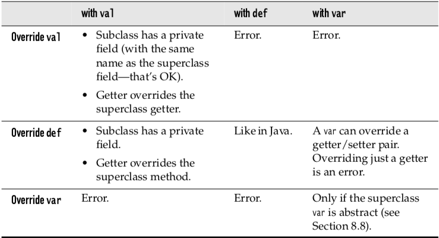

## Object-Oriented
*	Encapsulation
* 	Abstraction
*  Inheritance
*  Polymorphism

### Hierarchy
*	`is-a` 	继承 `class A extends B`
* 	`part-of` 组合 `class B { var A}`

```
class Son extends Father {

}
```

### 1. Singleton objects
*	Scala cannot have static members(methods or fields)
* 	`object` - An object can have essentially all the features of a class—it can even extend other classes or traits
*	compannion object and companion class in the same source file
*	can access each other's private members 
*	singleton objects cannot take constructor parameters(can not use `new`)
* 	standalone object(no companion class)
	*	not share the same name with a companion class
	* 	collenting related utility methods together
	*  define an entry point to a Scala application(as `main` method)

```
object Summer {
	def main(args: Array[String]) = {
		for (arg <- args)
			prinln(arg + ": " calculate(arg))
	}
}  
```

```
object Summer extends App {
	for(season <- List("fall","winter","spring"))
		println(season + ":" + calculate(season))
}
```


### 2. Companion Objects
*	The class and its companion object can access each other's private features(Java instance methods and static methods)
* 	In the same source file.

```
class Account {
	val id = Account.UUID()
	private var balance = 0.0
	def deposit(amount: Double) { balance += amount}
}

// The Companion object
object Account {
	praivete var lastNumber = 0
	private def UUID() = {lastNumber += 1; lastNumber}
}
```
	
### 3. Objects Extending a Class ot Trait
*	An object can extend a class and/or one or more traits. 

```
abstract class UndoableAction(val description: String) {
	def undo(): Unit
	def redo(): Unit
}

object DoNothingAction extends UndoableAction("Do nothing") {
	override def undo() {}
	override def redo() {}
}

val actions = Map("open" -> DoNothingAction, "save" -> DoNothingAction, ... )
```

#### The `apply` method
*	Returns an object of the companion class.
* 	Not having the new keyword 

```
Object(arg1, ... , argN)

Array(100) // apply(100)  yieding an Array[Int] with a single element
new Array(100) // this(100)
```

```
class Account private(val id: Int, initialBalance: Double) {
	private var balance = initialBalance
}

Object Account {
	def apply(initialBalance: Double) = {
		new Account(UUID(), initialBalance)
	}
}

val acct = Account(1000.0)
```

### 4. Application Objects

```
object Hello extends App {
	if(args.length > 0) {
		println(f"Hello ${args(0)}")
	} else {
		println("Hello, World")
	}
}

scalac Hello.scala
scala -Dscala.time Hello Fred
```

### 5. Enumerations
*	No enumerated types

```
object TrafficLightColor extends Enumeration {
	val Red, Yellow, Green = Value
}
```

### 6. Overriding Fields
*	private field
* 	accessor/mutator

*	A `def` can only override another `def`
* 	A `val` can only override another `val` or a parameterless `def`
*	A `var` can only override an `abstarct var`



### 7. Abstract Classed
*	abstract method
* 	abstract fields

```
abstrace class Person(val name: String) {
	def id: Int 
}

class Employee(name: String) extends Person(name) {
	def id = name.hashCode
}
```

```
abstract class Person {
	val id: Int
	var name: String
}

class Employee(val id: Int) extends Person {
	var name = ""
}

var fred = new Person {
	val id = 111
	var name = "Fred"
}
```

### 8. Construction Order and Early Definitions
```
class Creature {
	val range:  Int = 10
	val env: Array[Int] = new Array[Int](range)
}

class Ant extends {override val range = 2} with Creature
```


### References
*	Wirfs-Brock R, McKean A (2002) Object design: roles, responsibilities and collaborations.
